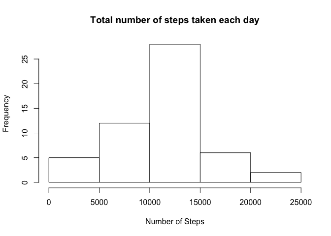
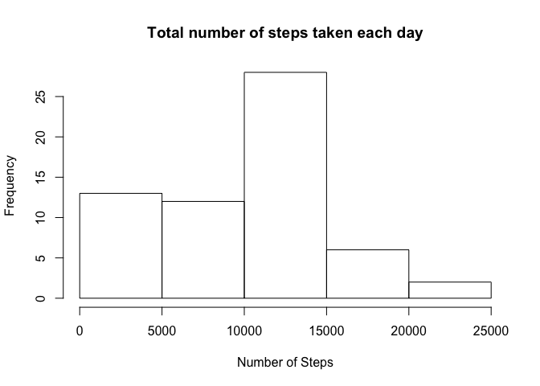
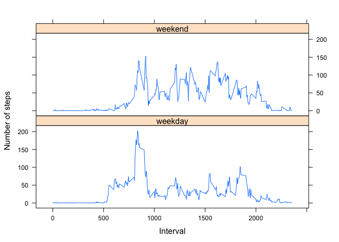

## R Markdown

The data is already nicely formatted so no need to process or change further. I will use the Data Frame StepsData for all further questions and process or transform as required per question.


```r
StepsData <- read.csv("activity.csv")
```

What is the total number of steps taken per day?

Total number of steps ignoring NA values from the dataset is:

```r
aggregate(steps ~ date, StepsData, mean, na.rm=TRUE)
```

```
##          date      steps
## 1  2012-10-02  0.4375000
## 2  2012-10-03 39.4166667
## 3  2012-10-04 42.0694444
## 4  2012-10-05 46.1597222
## 5  2012-10-06 53.5416667
## 6  2012-10-07 38.2465278
## 7  2012-10-09 44.4826389
## 8  2012-10-10 34.3750000
## 9  2012-10-11 35.7777778
## 10 2012-10-12 60.3541667
## 11 2012-10-13 43.1458333
## 12 2012-10-14 52.4236111
## 13 2012-10-15 35.2048611
## 14 2012-10-16 52.3750000
## 15 2012-10-17 46.7083333
## 16 2012-10-18 34.9166667
## 17 2012-10-19 41.0729167
## 18 2012-10-20 36.0937500
## 19 2012-10-21 30.6284722
## 20 2012-10-22 46.7361111
## 21 2012-10-23 30.9652778
## 22 2012-10-24 29.0104167
## 23 2012-10-25  8.6527778
## 24 2012-10-26 23.5347222
## 25 2012-10-27 35.1354167
## 26 2012-10-28 39.7847222
## 27 2012-10-29 17.4236111
## 28 2012-10-30 34.0937500
## 29 2012-10-31 53.5208333
## 30 2012-11-02 36.8055556
## 31 2012-11-03 36.7048611
## 32 2012-11-05 36.2465278
## 33 2012-11-06 28.9375000
## 34 2012-11-07 44.7326389
## 35 2012-11-08 11.1770833
## 36 2012-11-11 43.7777778
## 37 2012-11-12 37.3784722
## 38 2012-11-13 25.4722222
## 39 2012-11-15  0.1423611
## 40 2012-11-16 18.8923611
## 41 2012-11-17 49.7881944
## 42 2012-11-18 52.4652778
## 43 2012-11-19 30.6979167
## 44 2012-11-20 15.5277778
## 45 2012-11-21 44.3993056
## 46 2012-11-22 70.9270833
## 47 2012-11-23 73.5902778
## 48 2012-11-24 50.2708333
## 49 2012-11-25 41.0902778
## 50 2012-11-26 38.7569444
## 51 2012-11-27 47.3819444
## 52 2012-11-28 35.3576389
## 53 2012-11-29 24.4687500
```

Histogram of total number of steps taken each day:


```r
hist(aggregate(steps ~ date, StepsData, sum, na.rm=TRUE )$steps, main = "Total number of steps taken each day", xlab = "Number of Steps", ylab = "Frequency")
```

<!-- -->

The mean of the total number of steps taken each day is 

```r
mean(aggregate(steps ~ date, StepsData, mean, na.rm=TRUE )$steps)
```

```
## [1] 37.3826
```

The median of the total number of steps taken each day is 

```r
 median(aggregate(steps ~ date, StepsData, mean, na.rm=TRUE )$steps)
```

```
## [1] 37.37847
```


What is the average daily activity pattern?

```r
AggregatedStepsData <-aggregate(steps ~ interval, StepsData, mean, na.rm=TRUE)
plot(AggregatedStepsData, type = "l")
```

<!-- -->

The 5 minute interval containing the maximum number of steps on average across all days in this dataset is 

```r
AggregatedStepsData[which.max(AggregatedStepsData$steps), ]$interval
```

```
## [1] 835
```

Imputing Missing Values

Total number of missing values for steps in this dataset are 

```r
sum(is.na(StepsData$steps))
```

```
## [1] 2304
```

Filling missing values by overall mean for that interval

```r
FilledStepsData <- merge(x = StepsData, y = AggregatedStepsData, by = "interval", all.x =TRUE)
colnames(FilledStepsData) <- c("interval", "steps", "date", "meanforinterval")
FilledStepsData$steps[is.na(FilledStepsData$steps)] <- FilledStepsData$meanforinterval
```

```
## Warning in FilledStepsData$steps[is.na(FilledStepsData$steps)] <-
## FilledStepsData$meanforinterval: number of items to replace is not a
## multiple of replacement length
```

Histogram of total number of steps taken each day:

```r
hist(aggregate(steps ~ date, FilledStepsData, sum, na.rm=TRUE )$steps, main = "Total number of steps taken each day", xlab = "Number of Steps", ylab = "Frequency")
```

<!-- -->

The mean of the total number of steps taken each day is 

```r
mean(aggregate(steps ~ date, FilledStepsData, mean, na.rm=TRUE )$steps)
```

```
## [1] 32.53971
```

The median of the total number of steps taken each day is 

```r
median(aggregate(steps ~ date, FilledStepsData, mean, na.rm=TRUE )$steps)
```

```
## [1] 36.09375
```

The Mean and Median of the steps per interval differ in few points mean by 3.5 and Median by 0.4) after replacing the NA values with overall median value for that interval. 

The mean got much closer to the median after imputing the NA values.

Are there differences in activity patterns between weekdays and weekends?


```r
FilledStepsData$DayType <- factor(ifelse(weekdays(as.Date(FilledStepsData$date, "%Y-%m-%d")) %in% c("Saturday", "Sunday"), "weekend", "weekday"))
```

```
## Warning in strptime(x, format, tz = "GMT"): unknown timezone 'zone/tz/
## 2018e.1.0/zoneinfo/Europe/Amsterdam'
```

```r
AggregateDayType <- aggregate(steps ~ interval + DayType, FilledStepsData, mean)

xyplot(steps ~ interval | DayType, data = AggregateDayType, type = "l", xlab = "Interval", ylab = "Number of steps", layout = c(1,2))
```

<!-- -->

